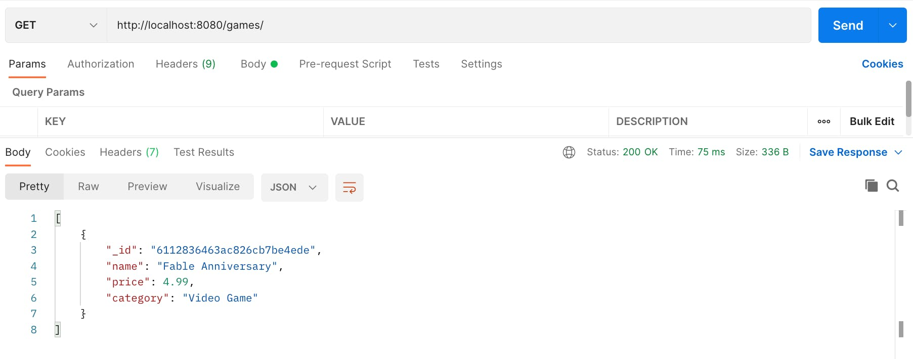
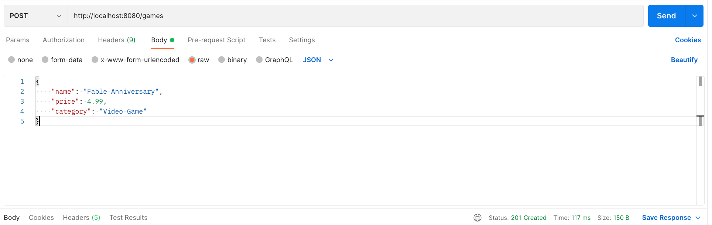

# **MongoDB and Typescript**

Software Engineering, Tutorial

#### Antonio Bucchiarone - bucchiarone@fbk.eu

*Academic year 2023/2024*


---

# Contents of today class

- JSON
- [NodeJS](https://nodejs.org/) and [NPM](https://www.npmjs.com/)
- [MongoDB](www.mongodb.com) and [Mongoose](https://mongoosejs.com/)
- Typescript

> Material: https://github.com/antbucc/IS-23_24


---
# JSON

- JSON stands for *J*ava*S*cript *O*bject *N*otation

- JSON is a text format for storing and transporting data

- JSON is "self-describing" and easy to understand

    `{"name":"John", "age":30, "car":null}`

- object with 3 properties: name, age, car


---
# JSON Values

In JSON, values must be one of the following data types:

- a string
- a number
- an object
- an array
- a boolean
- null


---
# JSON Examples

`{"name":"John"}`
`{"age":30}`
`{"employee":{"name":"John", "age":30, "city":"New York"}}`
`{"employees":["John", "Anna", "Peter"]}`
`{"sale":true}`
`{"middlename":null}`

---
# JSON.parse()

- A common use of JSON is to exchange data to/from a web server.

- When receiving data from a web server, the data is always a string.

- Parse the data with JSON.parse(), and the data becomes a JavaScript object.

`{"name":"John", "age":30, "city":"New York"}`
`const obj = JSON.parse('{"name":"John", "age":30, "city":"New York"}');`

---
 
 - Example 1: Create an Object from a JSON String
 - Example 2: Convert a string into a date object.
 - Example 3: Access Array Values


---
# NodeJS - https://nodejs.org/

- Node.js is an **open-source** and **cross-platform** JavaScript runtime environment. 

- Node.js runs the **V8 JavaScript engine**, the core of Google Chrome, outside of the browser. This allows Node.js to be very performant.

- When Node.js performs an **I/O operation**, like reading from the network, **accessing a database** or the filesystem, instead of blocking the thread and wasting CPU cycles waiting, Node.js will resume the operations when the response comes back.

- This allows Node.js to handle thousands of **concurrent connections** with a **single server** without introducing the burden of managing thread concurrency, which could be a significant source of bugs.

---

 # npm  - https://www.npmjs.com/

 - **npm** with its simple structure helped the ecosystem of Node.js proliferate, and now the npm registry hosts over 1,000,000 open source packages you can freely use.

  `npm install -g npm`

  Checking your version of npm and Node.js
    `node -v`
    `npm -v`


---

# MongoDB - mongodb.com

> https://www.mongodb.com/en-us/what-is-mongodb

- MongoDB stores data in flexible, JSON-like documents, meaning fields can vary from document to document and data structure can be changed over time

- The document model maps to the objects in your application code, making data easy to work with

- Ad hoc queries, indexing, and real time aggregation provide powerful ways to access and analyze your data

- MongoDB is a distributed database at its core, so high availability, horizontal scaling, and geographic distribution are built in and easy to use

- MongoDB is free to use.


---

# Typescript
- **Microsoft** developed **TypeScript** as a superset of JavaScript that has a single open-source compiler. 
- It has all the same features of JavaScript, but with an additional layer on top: the **type system**. 

- This allows for optional static typing, as well as type inference. 

- In addition to many other languages, MongoDB also supports TypeScript through the MongoDB NodeJS Driver. 

- The driver has the types for Typescript already built in so there is no need for any other packages.

---

# Why TypeScript


- **JavaScript** has long been one of the most used languages when developing web applications. It can be used either on the **front end**, or in the **back end** using **Node.js**.

- However, JavaScript isn’t without its limitations, such as a **lack of static typing**, making it much harder to spot issues at compile-time and leading to harder-to-debug errors at runtime. 

- As the size of a project increases, the **maintainability** and **readability** of the code reduces as well.

- This is **where TypeScript comes in**. It’s an extra layer on top of JavaScript, but adds static types. 


---

- TypeScript uses a transpiler at build time to convert the TypeScript code into JavaScript. 

- Therefore, you can continue using any JavaScript libraries in your project.

- At the application layer, when working on the code, developers get types and type-checking. 

- By being limited by types, errors will be raised at time of coding, or build time, reducing the number of bugs.


In this **tutorial**, you will learn how to get started using **MongoDB Atlas**, **MongoDB’s Database-as-a-Service**.

---

# Prerequisites

1. You will need to have **Node** installed in order to follow along with this tutorial. 

2. You will also need to create a MongoDB database. The easiest way to get started with MongoDB is to create a **free cluster in MongoDB Atlas**, MongoDB's fully-managed, multi-cloud document database service.

---

# Step 1 — Installing and Compiling TypeScript

- The first step toward working with TypeScript is to install the package globally on your computer. Install the typescript package globally by running the following command in your terminal:

```shell
 npm install -g typescript
```

- Next, run the following command to make a project directory:
```shell
  mkdir typescript_test
```  

---

- Move into the newly created directory:

```shell
  cd typescript_test
```  
You can now open up VS Code and create a new file **app.ts**

---

 - Create a function that will print the first and last name from a person object:

```typescript
export {};

function welcomePerson(person) {
  console.log(`Hey ${person.firstName} ${person.lastName}`);
  return `Hey ${person.firstName} ${person.lastName}`;
}

const james = {
  firstName: "James",
  lastName: "Quick"
};

welcomePerson(james);
```  

--- 

- The **problem** with the code above is that there is no restriction on what can be passed to the **welcomePerson** function.
-  In TypeScript, you can create **interfaces** that define what **properties** an **object** should have.

---

```typescript
export {};

function welcomePerson(person: Person) {
  console.log(`Hey ${person.firstName} ${person.lastName}`);
  return `Hey ${person.firstName} ${person.lastName}`;
}

const james = {
  firstName: "James",
  lastName: "Quick"
};

welcomePerson(james);

interface Person {
  firstName: string;
  lastName: string;
}
```  

---
- Now that you have a working TypeScript file, you can compile it to JavaScript. 
 
- To do this you need to call the function and tell it which file to compile. 
- You can utlize the built-in terminal in VS Code to do this.

https://code.visualstudio.com/docs/typescript/typescript-compiling
https://code.visualstudio.com/docs/typescript/typescript-tutorial


Note:
```shell
npm i typescript --save-dev
npx tsc --version
npx tsc app.ts
```
---
# Adding the MongoDB NodeJS Driver

- The first thing you will need to do is add the MongoDB npm package. 

- From the root of the project in your terminal of choice, use the following command to install the MongoDB NodeJS Driver

```shell
npm install mongodb
```

---
# Dotenv

**Dotenv** is a zero-dependency module that loads environment variables from a .env file

```shell
  npm install dotenv --save
```

- It’s good practice to add the **.env** file to a **.gitignore** file to avoid leaking API keys, connection strings, and other private config settings.

- Add a **.env** file to the root of the project and add the following, populating the value strings with the details from **Atlas**.

https://www.mongodb.com/basics/clusters

---

- Your .env file should look similar to this when complete.

```shell
DB_CONN_STRING="mongodb+srv://<username>:<password>@sandbox.jadwj.mongodb.net"
DB_NAME="gamesDB"
GAMES_COLLECTION_NAME="games"
```
- Make sure your connection string has had any templated values such as <password> replaced with your password you set when creating the user.

---

# Creating Models with TypeScript

- In TypeScript, **classes** or **interfaces** can be used to create **models** to represent what our documents will look like. 

- **Classes** can define what **properties** an **object** should have, as well as what data type those properties should be. This is like an application-level schema. 

- **Classes** also provide the ability to create **instances** of that class and take advantage of the benefits of object-orientated programming.

- To keep the code clean, we will create folders under the **src/** directory to hold the relevant files. Create a new **“models”** folder inside the src folder.

---

Inside this folder, create a file called **game.ts** and paste the following outline into it:

```typescript
// External dependencies

// Class Implementation
```

- Next, under the ‘External Dependencies’ section, add:

```typescript
import { ObjectId } from "mongodb";
```

- **ObjectId** is a unique MongoDB data type which is used for the ‘_id’ field that every document has and is used as a unique identifier and acts as the primary key.

---

- Now it’s time to create our **class**. Paste the following code under the “Class Implementation” heading:

```typescript
export default class Game {
    constructor(public name: string, public price: number, public category: string, public id?: ObjectId) {}
}
```

- properties for our **game model** and their **data types**, to take advantage of TypeScript as part of the constructor. 
- This allows the objects to be created, while also defining the properties. 
- The id property has a ? after it to denote that it’s optional. 
- Although every document in MongoDB has an id, it won’t always exist at code level, such as when you are creating a document. 
- In this instance, the ‘_id’ field is auto-generated at creation time.

---

# Creating Services

- Now we need to create our **service** that will talk to the database. 

- This class will be responsible for configuring the **connection**.

- Create a new folder under **src/** called **‘services’** and inside that, create a **database.service.ts** file and paste the following outline:

```typescript
// External Dependencies

// Global Variables

// Initialize Connection
```

---
 - As this service will be connecting to the database, it will need to use the **MongDB NodeJS** driver and **.env** config. Paste the following under the “External Dependencies” heading:

   ```typescript
   import * as mongoDB from "mongodb";
   import * as dotenv from "dotenv";
   ```
 - We want to access our collection from outside our service, so, under the “Global Variables” heading, add:

  ```typescript
     export const collections: { games?: mongoDB.Collection } = {}
  ```

---

# Function in a service

- We want to have a function that can be called to initialize the connection to the database so it’s ready for when we want to talk to the database later in the code. 

- Under “Initialize Connection,” paste the following:

```typescript
export async function connectToDatabase () {
   dotenv.config();

   const client: mongoDB.MongoClient = new mongoDB.MongoClient(process.env.DB_CONN_STRING);
           
   await client.connect();
       
   const db: mongoDB.Db = client.db(process.env.DB_NAME);
  
   const gamesCollection: mongoDB.Collection = db.collection(process.env.GAMES_COLLECTION_NAME);

   collections.games = gamesCollection;
        console.log(`Successfully connected to database: ${db.databaseName} 
        and collection: ${gamesCollection.collectionName}`);
}
```

---
# Creating Routes

- Now that we have the functionality available to communicate with the database, it’s time to provide **endpoints** for the client side to communicate using **Express** and perform CRUD operations.

- In order to keep the code clean, we are going to create a **router** which will handle all calls to the same endpoint, in this case, **‘/game’**. 

- These endpoints will also talk to our database service.


---

- Under ‘/src’, create a **‘routes’** folder, and inside that folder, create a file called **games.router.ts** and paste the following outline:

```typescript
 // External Dependencies

// Global Config

// GET

// POST

// PUT

// DELETE
```
---

- Under ‘External Dependencies’, paste the following import statements:
```typescript
import express, { Request, Response } from "express";
import { ObjectId } from "mongodb";
import { collections } from "../services/database.service";
import Game from "../models/game";
```

- We then need to set up our **router** before we can start coding the endpoints, so paste the following under ‘Global Config’:

```typescript
export const gamesRouter = express.Router();

gamesRouter.use(express.json());
```
---

# GET API

- The first endpoint we will add is our default GET route:

```typescript
 gamesRouter.get("/", async (_req: Request, res: Response) => {
    try {
       const games = (await collections.games.find({}).toArray()) as Game[];

        res.status(200).send(games);
    } catch (error) {
        res.status(500).send(error.message);
    }
});
```

---

# POST API


- Express and TypeScript make handling POST requests to create a new document in your collection.

```typescript
gamesRouter.post("/", async (req: Request, res: Response) => {
    try {
        const newGame = req.body as Game;
        const result = await collections.games.insertOne(newGame);

        result
            ? res.status(201).send(`Successfully created a new game with id ${result.insertedId}`)
            : res.status(500).send("Failed to create a new game.");
    } catch (error) {
        console.error(error);
        res.status(400).send(error.message);
    }
});

```

--- 

   - A new game object is create by parsing the request body. 
   - the **insertOne** method to create a single document inside a collection, passing the new game. 
   - If a collection does not exist, the first write operation will implicitly create it. 
   - The same thing happens when we create a database. The first structure inside a database will implicitly create it.

   - We then do some simple error handling, returning a status code and message, depending on the outcome of the insert.

---
# Testing Our Methods

 - in your CLI, enter the following to build and run the application:

   ```shell
      npm run start
   ```

This will then start the application at http://localhost:8080 that you can use your API client of choice (such as Postman) to test your application via the endpoints.

---

# GET API TEST with POSTMAN



---

# POST API TEST with POSTMAN



---

The below diagram shows the overall architecture of the code.


---

# Questions?

bucchiarone@fbk.eu


