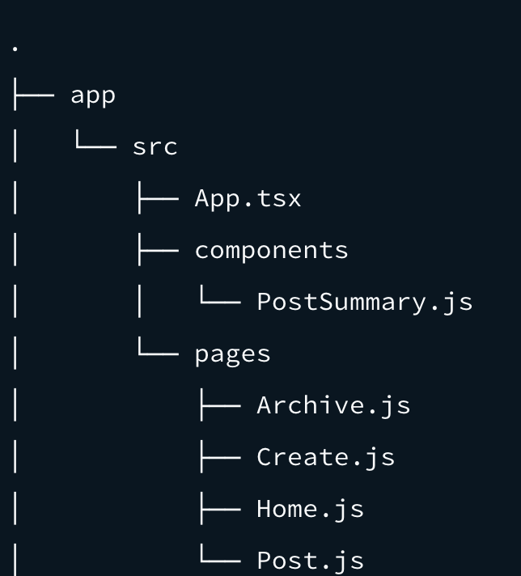

# **MongoDB and Typescript**

Software Engineering, Tutorial

#### Antonio Bucchiarone - bucchiarone@fbk.eu

*Academic year 2023/2024*


---

# Contents of today class

- JSON
- [NodeJS](https://nodejs.org/) and [NPM](https://www.npmjs.com/)
- [MongoDB](www.mongodb.com) and [Mongoose](https://mongoosejs.com/)
- Typescript

> Material: https://github.com/antbucc/IS-23_24


---
# Dotenv

**Dotenv** is a zero-dependency module that loads environment variables from a .env file

```shell
  npm install dotenv --save
```

- It’s good practice to add the **.env** file to a **.gitignore** file to avoid leaking API keys, connection strings, and other private config settings.

- Add a **.env** file to the root of the project and add the following, populating the value strings with the details from **Atlas**.

https://www.mongodb.com/basics/clusters

---

- Your .env file should look similar to this when complete.

```shell
DB_CONN_STRING="mongodb+srv://<username>:<password>@sandbox.jadwj.mongodb.net"
DB_NAME="gamesDB"
GAMES_COLLECTION_NAME="games"
```
- Make sure your connection string has had any templated values such as <password> replaced with your password you set when creating the user.

---

# Creating Models with TypeScript

- In TypeScript, **classes** or **interfaces** can be used to create **models** to represent what our documents will look like. 

- **Classes** can define what **properties** an **object** should have, as well as what data type those properties should be. This is like an application-level schema. 

- **Classes** also provide the ability to create **instances** of that class and take advantage of the benefits of object-orientated programming.

- To keep the code clean, we will create folders under the **src/** directory to hold the relevant files. Create a new **“models”** folder inside the src folder.

---

Inside this folder, create a file called **game.ts** and paste the following outline into it:

```typescript
// External dependencies

// Class Implementation
```

- Next, under the ‘External Dependencies’ section, add:

```typescript
import { ObjectId } from "mongodb";
```

- **ObjectId** is a unique MongoDB data type which is used for the ‘_id’ field that every document has and is used as a unique identifier and acts as the primary key.

---

- Now it’s time to create our **class**. Paste the following code under the “Class Implementation” heading:

```typescript
export default class Game {
    constructor(public name: string, public price: number, public category: string, public id?: ObjectId) {}
}
```

- properties for our **game model** and their **data types**, to take advantage of TypeScript as part of the constructor. 
- This allows the objects to be created, while also defining the properties. 
- The id property has a ? after it to denote that it’s optional. 
- Although every document in MongoDB has an id, it won’t always exist at code level, such as when you are creating a document. 
- In this instance, the ‘_id’ field is auto-generated at creation time.

---

# Creating Services

- Now we need to create our **service** that will talk to the database. 

- This class will be responsible for configuring the **connection**.

- Create a new folder under **src/** called **‘services’** and inside that, create a **database.service.ts** file and paste the following outline:

```typescript
// External Dependencies

// Global Variables

// Initialize Connection
```

---
 - As this service will be connecting to the database, it will need to use the **MongDB NodeJS** driver and **.env** config. Paste the following under the “External Dependencies” heading:

   ```typescript
   import * as mongoDB from "mongodb";
   import * as dotenv from "dotenv";
   ```
 - We want to access our collection from outside our service, so, under the “Global Variables” heading, add:

  ```typescript
     export const collections: { games?: mongoDB.Collection } = {}
  ```

---

# Function in a service

- We want to have a function that can be called to initialize the connection to the database so it’s ready for when we want to talk to the database later in the code. 

- Under “Initialize Connection,” paste the following:

```typescript
export async function connectToDatabase () {
   dotenv.config();

   const client: mongoDB.MongoClient = new mongoDB.MongoClient(process.env.DB_CONN_STRING);
           
   await client.connect();
       
   const db: mongoDB.Db = client.db(process.env.DB_NAME);
  
   const gamesCollection: mongoDB.Collection = db.collection(process.env.GAMES_COLLECTION_NAME);

   collections.games = gamesCollection;
        console.log(`Successfully connected to database: ${db.databaseName} 
        and collection: ${gamesCollection.collectionName}`);
}
```

---
# Creating Routes

- Now that we have the functionality available to communicate with the database, it’s time to provide **endpoints** for the client side to communicate using **Express** and perform CRUD operations.

- In order to keep the code clean, we are going to create a **router** which will handle all calls to the same endpoint, in this case, **‘/game’**. 

- These endpoints will also talk to our database service.


---

- Under ‘/src’, create a **‘routes’** folder, and inside that folder, create a file called **games.router.ts** and paste the following outline:

```typescript
 // External Dependencies

// Global Config

// GET

// POST

// PUT

// DELETE
```
---

- Under ‘External Dependencies’, paste the following import statements:
```typescript
import express, { Request, Response } from "express";
import { ObjectId } from "mongodb";
import { collections } from "../services/database.service";
import Game from "../models/game";
```

- We then need to set up our **router** before we can start coding the endpoints, so paste the following under ‘Global Config’:

```typescript
export const gamesRouter = express.Router();

gamesRouter.use(express.json());
```
---

# GET API

- The first endpoint we will add is our default GET route:

```typescript
 gamesRouter.get("/", async (_req: Request, res: Response) => {
    try {
       const games = (await collections.games.find({}).toArray()) as Game[];

        res.status(200).send(games);
    } catch (error) {
        res.status(500).send(error.message);
    }
});
```

---

# POST API


- Express and TypeScript make handling POST requests to create a new document in your collection.

```typescript
gamesRouter.post("/", async (req: Request, res: Response) => {
    try {
        const newGame = req.body as Game;
        const result = await collections.games.insertOne(newGame);

        result
            ? res.status(201).send(`Successfully created a new game with id ${result.insertedId}`)
            : res.status(500).send("Failed to create a new game.");
    } catch (error) {
        console.error(error);
        res.status(400).send(error.message);
    }
});

```

--- 

   - A new game object is create by parsing the request body. 
   - the **insertOne** method to create a single document inside a collection, passing the new game. 
   - If a collection does not exist, the first write operation will implicitly create it. 
   - The same thing happens when we create a database. The first structure inside a database will implicitly create it.

   - We then do some simple error handling, returning a status code and message, depending on the outcome of the insert.

---
# Testing Our Methods

 - in your CLI, enter the following to build and run the application:

   ```shell
      npm run start
   ```

This will then start the application at http://localhost:8080 that you can use your API client of choice (such as Postman) to test your application via the endpoints.

---

# GET API TEST with POSTMAN


---

# POST API TEST with POSTMAN


---

The below diagram shows the overall architecture of the code.


---

# Building a REST API with Express, Node, and MongoDB

---
 - The most popular framework for building restful APIs is  **Express**
 - It provides support for **http requests** out of the box and has an intuitive syntax for the standard http methods used in the REST principles.
 - You can easily integrate MongoDB with the native driver available to you. 
 - Using this stack, you can leverage MongoDB's document model with the REST API standard payload, which uses the JSON format.

---



---


---

# SERVER files

- The “server” directory hosts the **Express.js** server application and its dependencies. 

The main files here are:

- .env: Configuration file holding Atlas connection string details.
- db/conn.mjs: Exposes a global connection to the Atlas database.
- index.mjs: The main entry point for the Express server.
- loadEnvironment.mjs: Loads up the environment variables.
- routes/posts.mjs: Exposes the REST API endpoints and performs their business logic.

---

# Application files

- The “app” directory is where the front-end **React application** code resides. The main files here are:

- App.tsx: Front-end React code that manages the different routes of the front end.
- /components: A folder with the reusable components you will use.
- /pages: All application pages have their matching file in this folder.

---

# Setting Up the Project

- First, you will need to deploy an **Atlas cluster**. You can follow the 
Getting Started with Atlas
 guide to learn how to create a free Atlas account, create your first cluster, and get your 
connection string
 to the database.
---

# Set up the environment variables

- Edit the **.env** file to assign the **ATLAS_URI** variable the value of your connection string. Replace the credentials with your database username and password.

```typescript
ATLAS_URI=mongodb+srv://<username>:<password>@sandbox.jadwj.mongodb.net/myFirstDatabase?retryWrites=
PORT=5050
```

---

- Our application uses the **dotenv** package to load this **.env** file to add these values to the environment variables usable by the code.

- You will need the following code in the **loadEnvironment.mjs** file to load these environment variables.

```typescript
import dotenv from "dotenv";
dotenv.config();
```

---

# Entry point script

- The entry point script can then import this file, which will be executed immediately.
- In index.mjs, add the following line at the top.

```typescript
// Load environment variables
import "./loadEnvironment.mjs";
```

- The Atlas connection string will now be available to our other modules.


---

# Create the database module

- Open **server/db/conn.mjs** and replace the content with the following code. 
- This code will create a global database object that the other server components can reuse.

```typescript
import { MongoClient } from "mongodb";
const connectionString = process.env.ATLAS_URI || "";
const client = new MongoClient(connectionString);
let conn;
try {
  conn = await client.connect();
} catch(e) {
  console.error(e);
}
let db = conn.db("sample_training");
export default db;
```

---

# Create the database module

- This code uses the connection string provided in the **.env** file and creates a new client. 
- Once the client is defined, it tries to create a new connection to the database. 
- The **sample_training** database is then exported if the connection is successful. 
- This gives us a uniform interface that can be reused in all modules.

---

# RESP APIs

- The core of this tutorial is to expose REST API routes to perform Create, Read, Update, and Delete (CRUD) operations for our restful web service.

- all the routes for our server are located in the file server/routes/posts.mjs. 

- We then tell our server to use this module for all the incoming requests to routes that start with /posts. 

- This is done in the index.mjs file in the following line.

```typescript
// Load the /posts routes
app.use("/posts", posts);
```

---


--- 

# Read route

- The Read route will be returning 50 of the articles when there is a get request on the /posts route. 

```typescript
// Get a list of 50 posts
router.get("/", async (req, res) => {
  let collection = await db.collection("posts");
  let results = await collection.find({})
    .limit(50)
    .toArray();
  res.send(results).status(200);
});
```

--- 

# Read route (advanced)

- You can also create a more complex route using aggregation pipelines to return a result. 
- For example, we can add a route that will return the **three most recent articles** in the collection.

---

```typescript
// Fetches the latest posts
router.get("/latest", async (req, res) => {
  let collection = await db.collection("posts");
  let results = await collection.aggregate([
    {"$project": {"author": 1, "title": 1, "tags": 1, "date": 1}},
    {"$sort": {"date": -1}},
    {"$limit": 3}
  ]).toArray();
  res.send(results).status(200);
});
```

- This endpoint will catch all the get requests to /post/latest. 
- We then use an aggregation pipeline to sort the collection in descending order of date and limit the results to three.

---

# Read single result

- You can also use parametrized routes to return filtered results or, in this case, a single object. 
- :id parameter. You can then access the value of that parameter with req.params.id.- 

```typescript
// Get a single post
router.get("/:id", async (req, res) => {
  let collection = await db.collection("posts");
  let query = {_id: ObjectId(req.params.id)};
  let result = await collection.findOne(query);
  if (!result) res.send("Not found").status(404);
  else res.send(result).status(200);
});
```

- If no results are found, we can send a different response — a 404 error message.

---

# Create route

- The **Create** route will add a new post to our collection. 
- To catch a post request, you will use the **router.post** method from Express to define this route. 
- Based on the REST conventions, adding new items should be done with a POST method.

```typescript
// Add a new document to the collection
router.post("/", async (req, res) => {
  let collection = await db.collection("posts");
  let newDocument = req.body;
  newDocument.date = new Date();
  let result = await collection.insertOne(newDocument);
  res.send(result).status(204);
});
```

---

# Update route

- The Update route adds a new comment to our blog post. 
- Best practices in REST API design state that we should use a **PATCH** request for updates. 


---

# Update route

```typescript
// Update the post with a new comment
router.patch("/comment/:id", async (req, res) => {
  const query = { _id: ObjectId(req.params.id) };
  const updates = {
    $push: { comments: req.body }
  };
  let collection = await db.collection("posts");
  let result = await collection.updateOne(query, updates);
  res.send(result).status(200);
});
```

---

# Delete route

```typescript
// Delete an entry
router.delete("/:id", async (req, res) => {
  const query = { _id: ObjectId(req.params.id) };
  const collection = db.collection("posts");
  let result = await collection.deleteOne(query);
  res.send(result).status(200);
});
```


---

# test the app
```shell
cd server
npm install
npm run dev
```


```shell
cd app
npm install
npm start
```
---
# Questions?

bucchiarone@fbk.eu


