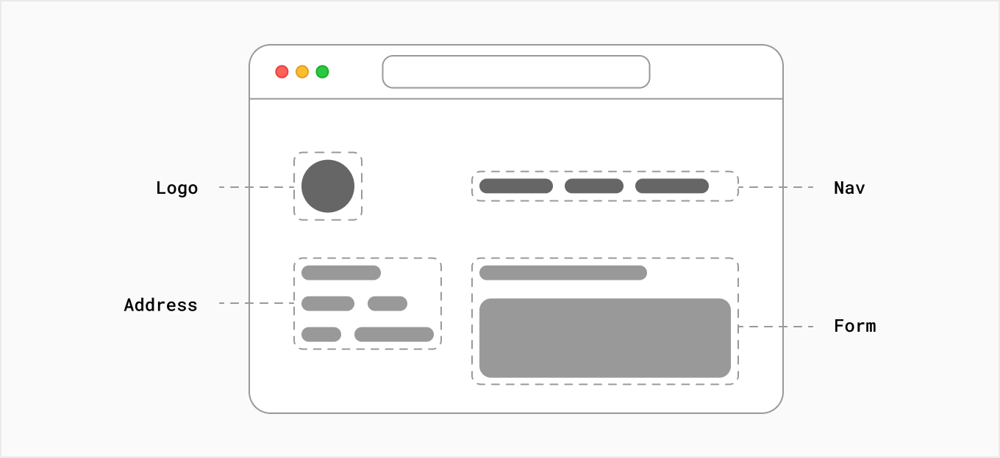
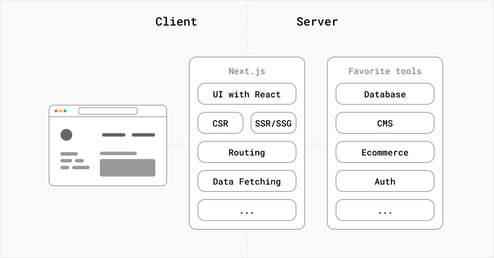
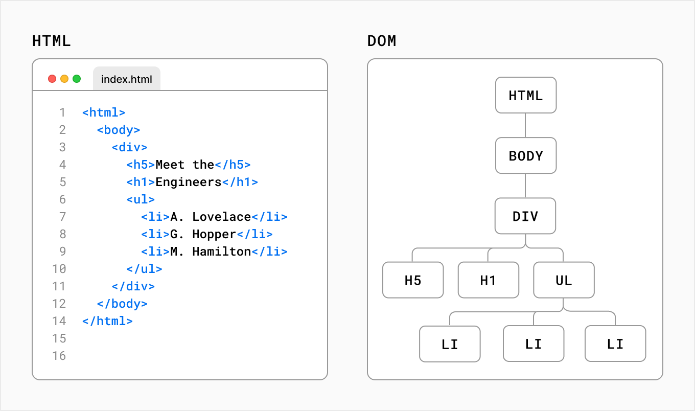
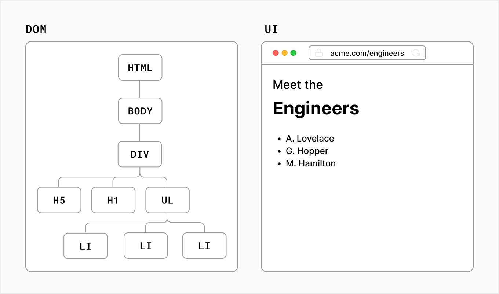
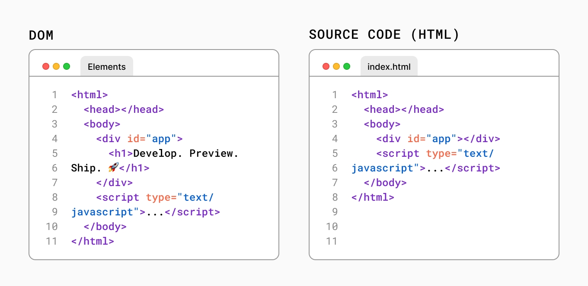
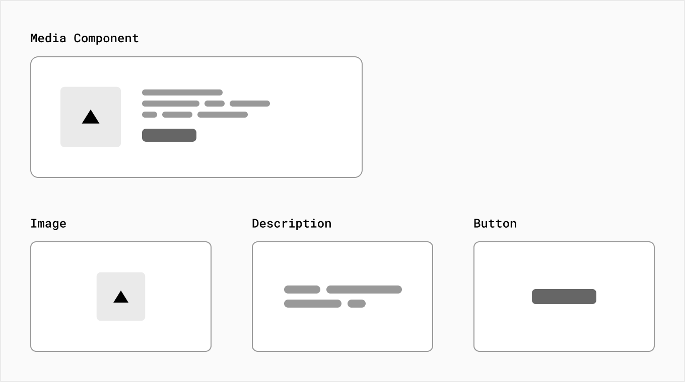
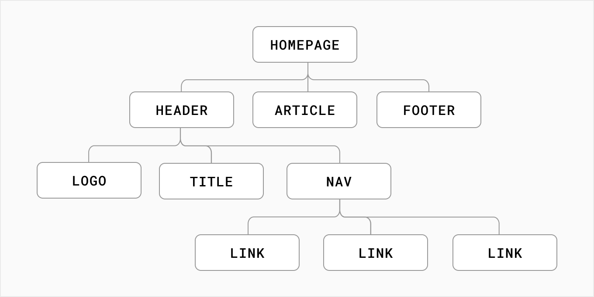
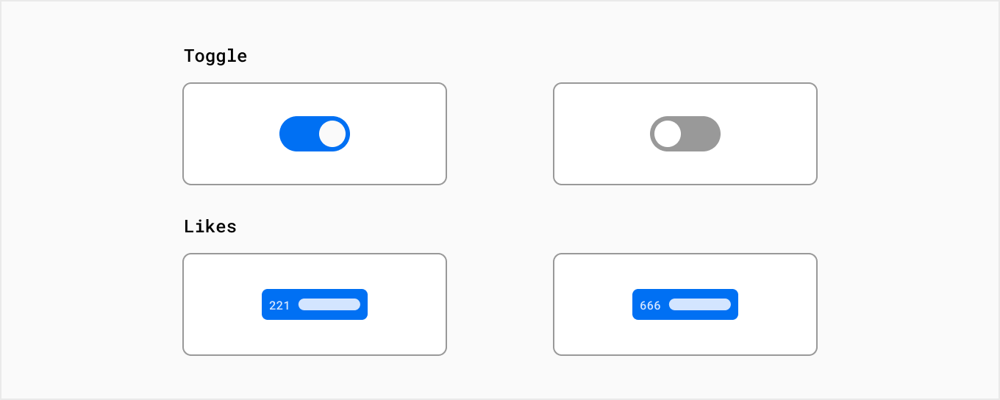

# **JavaScript and NextJS**

Software Engineering, Tutorial

#### Antonio Bucchiarone - bucchiarone@fbk.eu

*Academic year 2023/2024*


---

# Contents of today class

- JavaScript application, then migrating it to React and Next.js.

> Material: https://github.com/antbucc/IS-23_24


---
# Next.js

**Next.js** is a flexible **React** framework that gives you building blocks to create fast web applications.


---
# Building Blocks of a Web Application


- **User Interface** - how users will consume and interact with your application.
- **Routing** - how users navigate between different parts of your application.
- **Data Fetching** - where your data lives and how to get it.
- **Rendering** - when and where you render static or dynamic content.
- **Integrations** - what third-party services you use (CMS, auth, payments, etc) and how you connect to them.
- **Infrastructure** - where you deploy, store, and run your application code (Serverless, CDN, Edge, etc).
- **Performance** - how to optimize your application for end-users.
- **Scalability** - how your application adapts as your team, data, and traffic grow.

---

# What is React?

**React** is a JavaScript library for building interactive user interfaces.



- **React** provides helpful functions to build UI, but leaves it up to the developer where to use those functions in their application.

---

# What is Next.js

- **Next.js** is a **React framework** that gives you building blocks to create web applications.

- **Next.js** handles the tooling and configuration needed for React, and provides additional structure, features, and optimizations for your application.



---
# From JavaScript to React

*Rendering User Interfaces*

- To understand how React works, we first need a basic understanding of how browsers **interpret** your code to create interactive user interfaces (UI).

- When a user visits a web page, the server returns an HTML file to the browser that may look like this:

---



The browser then reads the HTML and constructs the Document Object Model (DOM).

---
# What is the DOM?

The DOM is an **object** representation of the HTML elements. It acts as a bridge between your code and the user interface, and has a tree-like structure with parent and child relationships.

---



--- 

# Updating the UI with JavaScript and DOM Methods

- Open your code editor and create a new index.html file. Inside the HTML file, add the following code:

```html {.center}
<html>
  <body>
    <div></div>
  </body>
</html>
```
---

- Then give the div a **unique id** so that you can target it later.

```html {.center}
<html>
  <body>
    <div id="app"></div>
  </body>
</html>
```
---

 - To write **JavaScript** inside your HTML file, add a script tag:
```html {.center}
<html>
  <body>
    <div id="app"></div>
    <script type="text/javascript"></script>
  </body>
</html>
```

---

- Now, inside the script tag, you can use a DOM method, **getElementById()**, to select the **<div>** element by its id:

```html {.center}
<html>
  <body>
    <div id="app"></div>

    <script type="text/javascript">
      const app = document.getElementById('app');
    </script>
  </body>
</html>
```
---

- You can continue using DOM methods to create a new <h1> element:

```html {.center}
    <script type="text/javascript">
      // Select the div element with 'app' id
      const app = document.getElementById('app');

      // Create a new H1 element
      const header = document.createElement('h1');

      // Create a new text node for the H1 element
      const headerContent = document.createTextNode(
        'Develop. Preview. Ship. 🚀',
      );

      // Append the text to the H1 element
      header.appendChild(headerContent);

      // Place the H1 element inside the div
      app.appendChild(header);
    </script>
```

--- 
# HTML vs. the DOM

-  To make sure everything is working, open your HTML file inside your browser of choice. You should see an h1 tag that says, 'Develop. Preview. Ship. 🚀

- f you look at the DOM elements inside your browser developer tools, you will notice the DOM includes the <h1> element. The DOM of the page is different from the source code - or in other words, the original HTML file you created.

---

# Quiz Time

True or False: You can update the page content by manipulating the DOM.

- True 
- False


---



- HTML represents the **initial page content**, whereas the DOM represents the **updated page content** which was changed by the JavaScript code you wrote.


---

# Imperative vs. Declarative Programming

- The code above is a good example of **imperative programming**. 

- steps for how the user interface should be updated. 

- to build user interfaces, a **declarative approach** is often preferred because it can speed up the development process. 

- Instead of having to write DOM methods, it would be helpful if developers were able to declare what they want to show (in this case, an h1 tag with some text).

-  **imperative programming** is like giving a chef **step-by-step **instructions on how to make a pizza. 

- **Declarative programming** is like ordering a pizza without being concerned about the steps it takes to make the pizza. 🍕

--- 
# Quiz Time

 Which of the following statements is more declarative?

- "Knit the dough, roll the dough, add tomato sauce, add cheese, add ham, add pineapple, bake at 200 degrees celsius in a stone oven for...”

- “A Hawaiian pizza please.”

--- 

# React: A declarative UI library

- As a developer, you can tell React **what you want to happen** to the user interface.
- React will figure out the **steps of how to update the DOM** on your behalf.

---

# From JavaScript to React

- To use React in your project, you can load two React scripts from an external website called **unpkg.com**:

    - **react** is the core React library.
    - **react-dom** provides DOM-specific methods that enable you to use React with the DOM.


---

```html {.center}
<html>
  <body>
    <div id="app"></div>

    <script src="https://unpkg.com/react@17/umd/react.development.js"></script>
    <script src="https://unpkg.com/react-dom@17/umd/react-dom.development.js"></script>

    <script type="text/javascript">
      const app = document.getElementById('app');
      ReactDOM.render(<h1>Develop. Preview. Ship. 🚀</h1>, app);
    </script>
  </body>
</html>
```

- Instead of directly manipulating the DOM with plain JavaScript, you can use the **ReactDOM.render()** method from react-dom to tell React to render our **<h1>** title inside our **#app** element.

- ERROR? This is because <h1>...</h1> is not valid Javascript. This piece of code is JSX.

---

# What is JSX?

- JSX stands for JavaScript XML
- JSX is a syntax extension for JavaScript that allows you to describe your UI in a familiar HTML-like syntax. 


- The nice thing about JSX is that apart from following three JSX rules, you don’t need to learn any new symbols or syntax outside of HTML and JavaScript.

- Note that browsers don’t understand JSX out of the box, so you’ll need a **JavaScript compiler**, such as a **Babel**, to transform your JSX code into regular JavaScript.

---

# Adding Babel to your project

```html {.center}
<script src="https://unpkg.com/@babel/standalone/babel.min.js"></script>
```

- In addition, you will need to inform Babel what code to transform by changing the script type to **type=text/jsx**.

```html {.center}
<script type="text/jsx">
      const app = document.getElementById('app');
      ReactDOM.render(<h1>Develop. Preview. Ship. 🚀</h1>, app);
    </script>
```

---

# Declarative vs Imperative

```html {.center}
<script type="text/jsx">
  const app = document.getElementById("app")
  ReactDOM.render(<h1>Develop. Preview. Ship. 🚀</h1>, app)
</script>
```
```html {.center}
<script type="text/javascript">
  const app = document.getElementById('app');
  const header = document.createElement('h1');
  const headerContent = document.createTextNode('Develop. Preview. Ship. 🚀');
  header.appendChild(headerContent);
  app.appendChild(header);
</script>
```

---

# Quick review

-  Why do you need to compile your React code?

1. React uses a new version of HTML that’s too advanced for current browsers.
2. React uses JSX which needs to be compiled into JavaScript.
3.  React doesn’t know how to update the DOM so it needs a compiler to do it.

---

# React core concepts

- There are three core concepts of React that you'll need to be familiar with to start building React applications. These are:

    - Components
    - Props
    - State

--- 

# Building UI with Components

- User interfaces can be broken down into smaller **building blocks** called **components**.

-- Components allow you to build **self-contained**, **reusable** snippets of code. 
- If you think of components as **LEGO bricks**, you can take these individual bricks and combine them together to form larger structures. 
- If you need to update a piece of the UI, you can **update the specific component or brick**.

---



---

# Creating components

- In React, **components** are **functions**.
```html {.center}
<script type="text/jsx">
  const app = document.getElementById("app")


  function header() {
  }

  ReactDOM.render(<h1>Develop. Preview. Ship. 🚀</h1>, app)
</script>
```

---

- A component is a function that **returns UI elements**. Inside the return statement of the function, you can write JSX:

```html {.center}
<script type="text/jsx">
  const app = document.getElementById("app")

  function header() {
    return (<h1>Develop. Preview. Ship. 🚀</h1>)
  }

  ReactDOM.render(, app)
</script>
```

---

- To render a component to the DOM, you can pass it as the first argument in the ReactDOM.render() method:

```html {.center}
<script type="text/jsx">

  const app = document.getElementById("app")

  function Header() {
  return <h1>Develop. Preview. Ship. 🚀</h1>;
}

ReactDOM.render(<Header />, app);
</script>
```

1. React components should be **capitalized** to distinguish them from plain HTML and JavaScript.
2. you use **React components the same way you’d use regular HTML tags**, with angle brackets <>.

---

# Nesting Components

- Applications usually include more content than a single component. - You can nest React **components inside each other** like you would regular HTML elements.

```html {.center}
function Header() {
  return <h1>Develop. Preview. Ship. 🚀</h1>;
}
function HomePage() {
  return <div></div>;
}

ReactDOM.render(<Header />, app);
```

---

- Then nest the **<Header>** component inside the new **<HomePage>** component:
```html {.center}
function Header() {
  return <h1>Develop. Preview. Ship. 🚀</h1>;
}

function HomePage() {
  return (
    <div>
      {/* Nesting the Header component */}
      <Header />
    </div>
  );
}

ReactDOM.render(<Header />, app);
```
---

# Component Trees

- You can keep nesting React components this way to form component trees.



- This modular format allows you to reuse components in different places inside your app.

---

-  Since **<HomePage>** is now your top-level component, you can pass it to the **ReactDOM.render()** method:

```html {.center}
function Header() {
  return <h1>Develop. Preview. Ship. 🚀</h1>;
}

function HomePage() {
  return (
    <div>
      <Header />
    </div>
  );
}

ReactDOM.render(<HomePage />, app);
```

---

# Quiz Time

- How would you nest a Header component inside a Layout component in React?


1. <Layout /><Header />
2. <Layout><Header /></Layout> 
3. <layout><header><header/><layout/>

---

# Displaying Data with Props

-  if you were to reuse your **<Header />** component, it would display the same content both times.

```html {.center}
function Header() {
  return <h1>Develop. Preview. Ship. 🚀</h1>;
}

function HomePage() {
  return (
    <div>
      <Header />
      <Header />
    </div>
  );
}
```

---
- what if you want to pass **different text** or you don't know the information ahead of time because you’re fetching data from an external source (i.e., APIs)?

- Regular HTML elements have attributes that you can use to pass pieces of information that change the behavior of those elements. 

- For example, changing the **src attribute** of an **** element changes the **image** that is shown. 

- Changing the **href attribute** of an **<a>** tag changes the destination of the link.

- In the same way, you can pass **pieces of information** as **properties** to React components. These are called **props**.

---

# Using props

```html {.center}
function Header({ title }) {
  console.log(title);
  return <h1>title</h1>;
}
```

---

# Example 1

```html {.center}
function createTitle(title) {
  if (title) {
    return title;
  } else {
    return 'Default title';
  }
}

function Header({ title }) {
  return <h1>{createTitle(title)}</h1>;
}
```

---

# Example 2

```html {.center}
function Header({ title }) {
  return <h1>{title ? title : 'Default title'}</h1>;
}

function HomePage() {
  return (
    <div>
      <Header />
    </div>
  );
}
```


---

# Iterating through lists

- You can then use the **array.map()** method to iterate over the array and use an arrow function to map a name to a list item:

```html {.center}
function HomePage() {
  const names = ['Ada Lovelace', 'Grace Hopper', 'Margaret Hamilton'];

  return (
    <div>
      <Header title="Develop. Preview. Ship. 🚀" />
      <ul>
        {names.map((name) => (
          <li key={name}>{name}</li>
        ))}
      </ul>
    </div>
  );
}

```

---

# Quiz time

- What are props used for in React?

1. Writing CSS rules
2. Passing information to components
3. Adding attributes to HTML elements


---

# Adding Interactivity with State

- Let's explore how React helps us add **interactivity** with **state** and **event** handlers.

- let’s create a like **button** inside your **HomePage** component. 

- First, add a **button** element inside the **return()** statement.


---

```html {.center}
function HomePage() {
  const names = ['Ada Lovelace', 'Grace Hopper', 'Margaret Hamilton'];

  return (
    <div>
      <Header title="Develop. Preview. Ship. 🚀" />
      <ul>
        {names.map((name) => (
          <li key={name}>{name}</li>
        ))}
      </ul>

      <button>Like</button>
    </div>
  );
}
```

---

# Listening to Events

- To make the button do something when **clicked**, you can make use of the **onClick** event.


```html {.center}
function HomePage() {
  // ...
  return (
    <div>
      {/* ... */}
      <button onClick={}>Like</button>
    </div>
  );
}
```

-  The **onClick** event is one of many possible events you can use to respond to user interaction. For example, you can use **onChange** for input fields or **onSubmit** for forms.

---

# Handling Events

- You can define a function to "handle" events whenever they are triggered. 

- Create a function before the return statement called handleClick():


---

```html {.center}
function HomePage() {
  //    ...
  function handleClick() {
    console.log('increment like count');
  }

  return (
    <div>
      {/* ... */}
      <button onClick={handleClick}>Like</button>
    </div>
  );
}
```

---

# State and Hooks

- React has a set of functions called **hooks**. 
-  **Hooks** allow you to add additional logic such as **state** to your components. 

- You can think of** state as any information in your UI** that changes over time, usually **triggered by user interaction**.




---

- You can use **state** to **store** and **increment** the number of times a user has clicked the like button. 

- **useState()** returns an array, and you can access and use those array values inside your component using array destructuring.
```html {.center}
function HomePage() {
  const [] = React.useState();

  // ...
}
```


---

- The first item in the array is the **state value**, which you can name anything. 
- It’s recommended to name it something descriptive.

```html {.center}
function HomePage() {
  const [likes] = React.useState();

  // ...
}
```

---

- The second item in the array is a **function to update the value**. 
- You can name the update function anything, but it's common to prefix it with **set** followed by the **name of the state variable** you’re updating.

```html {.center}
function HomePage() {
  const [likes, setLikes] = React.useState();

  // ...
}
```

---

- You can also take the opportunity to add the initial value of your likes state: zero.

```html {.center}
function HomePage() {
  const [likes, setLikes] = React.useState(0);
}
```

---

- you can call your state updater function, setLikes in your HomePage component, let's add it inside the handleClick() function you previously defined:

```html {.center}
function HomePage() {
  // ...
  const [likes, setLikes] = React.useState(0);

  function handleClick() {
    setLikes(likes + 1);
  }

  return (
    <div>
      {/* ... */}
      <button onClick={handleClick}>Likes ({likes})</button>
    </div>
  );
}
```

---

# Quiz time

What is the difference between props and state?

1. Props is read-only information that's passed to components. State is information that can change over time, usually triggered by user interaction.
2. Props are used to define the component's behaviour. State is used to style components.
3. Props contain temporary information about a component. State contains read-only information.


---
# We will start from Here....

```html {.center}
<html>
  <body>
    <div id="app"></div>

    <script src="https://unpkg.com/react@17/umd/react.development.js"></script>
    <script src="https://unpkg.com/react-dom@17/umd/react-dom.development.js"></script>
    <script src="https://unpkg.com/@babel/standalone/babel.min.js"></script>

    <script type="text/jsx">
      const app = document.getElementById("app")

      function Header({ title }) {
        return <h1>{title ? title : "Default title"}</h1>
      }

      function HomePage() {
        const names = ["Ada Lovelace", "Grace Hopper", "Margaret Hamilton"]

        const [likes, setLikes] = React.useState(0)

        function handleClick() {
          setLikes(likes + 1)
        }

        return (
          <div>
            <Header title="Develop. Preview. Ship. 🚀" />
            <ul>
              {names.map((name) => (
                <li key={name}>{name}</li>
              ))}
            </ul>

            <button onClick={handleClick}>Like ({likes})</button>
          </div>
        )
      }

      ReactDOM.render(<HomePage />, app)
    </script>
  </body>
</html>
```

---
# Questions?

bucchiarone@fbk.eu


